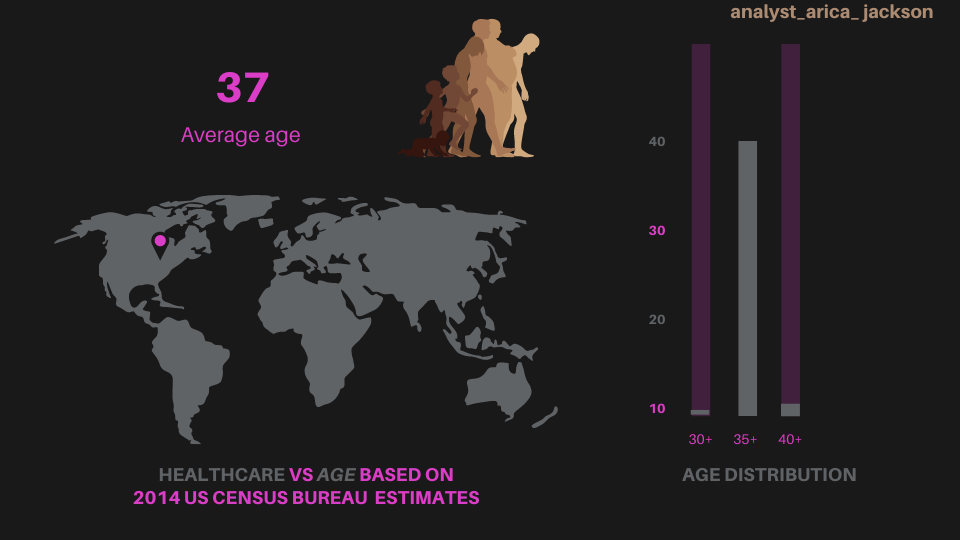

## https://ladyj-dev.github.io/D3-Challenge_asj/
Analyzing trends using D3, html and Javascript to create charts, graphs and interactive scatterplot

# D3-Challenge Data Journalism and D3

## Background

Welcome to the newsroom! You have accepted a position as a data visualization specialist for 'The Nested For-Loop', a rural news paper that's getting a lot of attention recently as more people move to the area now that working from home has become the norm. You are tasked with analyzing the current trends shaping people's lives, as well as creating charts, graphs, and interactive elements to help readers understand your findings.

The editor wants to run a series of feature stories about the health risks facing particular demographics. She's counting on you to sniff out the first story idea by sifting through information from the U.S. Census Bureau and the Behavioral Risk Factor Surveillance System.

The data set included with the assignment is based on 2014 ACS 1-year estimates from the [US Census Bureau](https://data.census.gov/cedsci/), but you are free to investigate a different data set. The current data set includes data on rates of income, obesity, poverty, etc. by state. MOE stands for "margin of error."

### Before You Begin

1. Create a new repository for this project called `D3-Challenge`. **Do not add this to an existing repository**.

2. Clone the new repository to your computer.

3. Inside your local git repository, create a directory for the D3 challenge. Use the folder name to correspond to the challenge: **D3_data_journalism**.

4. This homework utilizes both **html** and **Javascript** so be sure to add all the necessary files. These will be the main files to run for analysis.

5. Push the above changes to GitHub or GitLab.

## Your Task: Visualize data variables Healthcare vs Age

You need to create a scatter plot between two of the data variables. 

Using the D3 techniques, create a scatter plot that represents each state with circle elements. You'll code this graphic in the `app.js` file of your directory—make sure you pull in the data from `data.csv` by using the `d3.csv` function. 

* Include state abbreviations in the circles.

* Create and situate your axes and labels to the left and bottom of the chart.

* Note: You'll need to use `python -m http.server` to run the visualization. This will host the page at `localhost:8000` in your web browser.

* Ensure your repository has regular commits (i.e. 20+ commits) and a thorough README.md file

